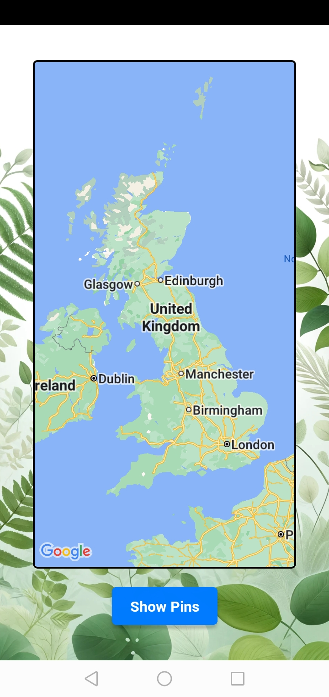
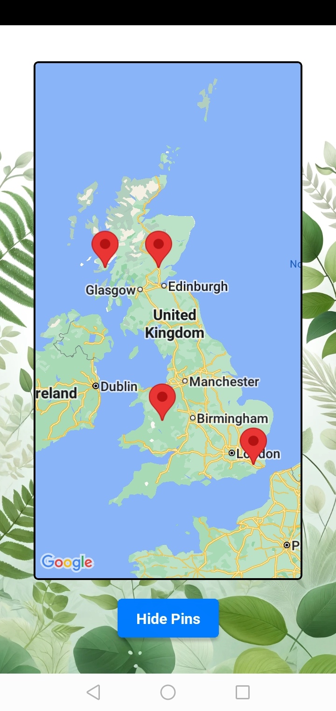
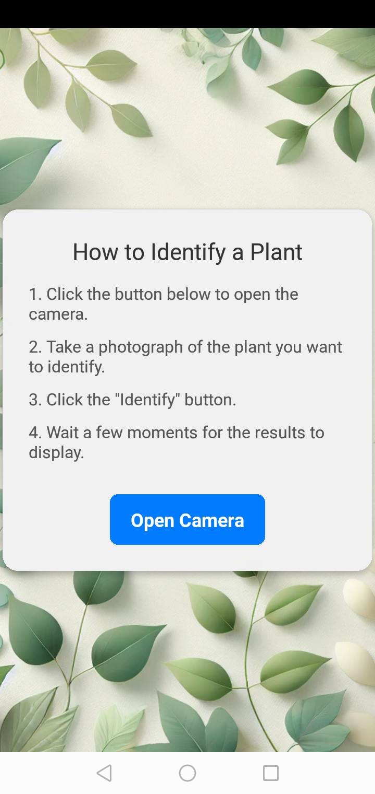
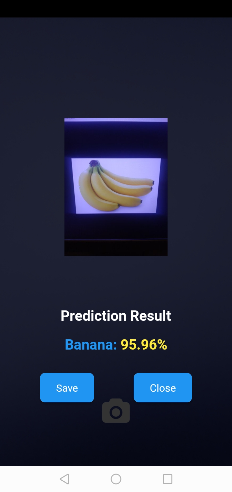
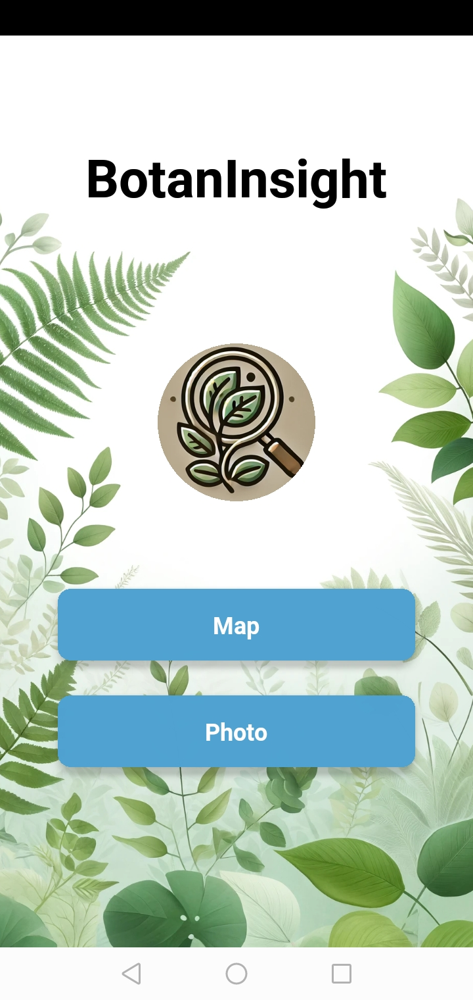

Plant Identification App

Overview

A React Native mobile application built with Expo that allows users to identify plant species using their device camera. The app leverages machine learning hosted on Google Cloud to process images and return identification results.

Features

Real-time plant identification using the device camera.

Machine learning model hosted on Google Cloud, accessed via Cloud Functions.

User authentication via Firebase.

Data storage of user-uploaded images and location data.

Google Maps integration to visualize identified plants on a map.

Screenshots

Here are some UI screenshots of the application:

Notes

⚠️ The database and cloud hosting are currently disabled, meaning user authentication, data storage, and machine learning features are not functional at this time.

Technologies Used

React Native (Expo) – Frontend framework for mobile development

Google Cloud Functions – Backend for processing images and interacting with the ML model

Firebase – User authentication and cloud storage

Google Maps API – Display plant locations on a map
